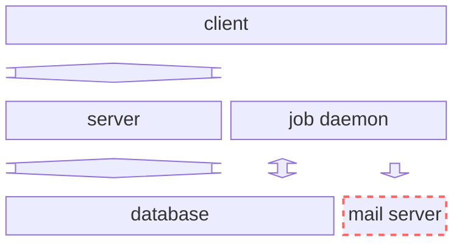
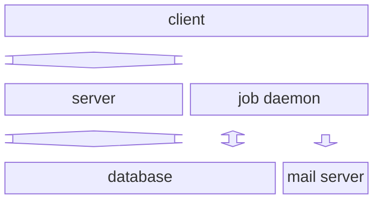

# Freestanding Principle

## Description

A project is freestanding when all components necessary for the operation and development of the project are provided by the project itself. A freestanding project doesn’t use resources that are shared with others or interact with external services that must be configured outside the project.

## Benefits

A freestanding project ensures each developer has a consistent development environment. A developer is free to experiment without the worry of impeding the progress of others.

A freestanding projects allows developers to share the entire state of their changes in a copyable form for others to build on or test.

## Violations

Having to manually configure a project before it can be successfuly run may point to a violation of the Freestanding principle. It may indicate that all components necessary for the operation and development of the project are not provided by the project.

Having project specific tooling live outside
TODO: Having to use tools outside the project - sync-to-live example.

## Approach

Virtualization or emulation should be used to provide all necessary components for the development and operation of a project. It may be necessary to build our own simulated component when the component we wish to simulate does not provide an off the shelf container.

Examples of virtualization or emulation includes things like:

- Docker: [PostgreSQL](https://hub.docker.com/_/postgres), [mailpit](https://hub.docker.com/r/axllent/mailpit), etc.
- [Firebase Local Emulator Suite](https://firebase.google.com/docs/emulator-suite)

## Case Studies

### SMTP for starmaker-rebuild

The architecture of the `starmaker-rebuild` project looked like the following. There is a database for storing the state of the system along with a client and server to allow users to interact with the system. Finally there is a job daemon for processing asynchronous jobs that may occur in the normal operation of the system. Examples of jobs are things like generating reports or sending any email required for the system to function.

One of the neccesary components of the system, an SMTP server, was not contained within the project. In order for any mail related features to be developed, improved, or tested an external mail server needed to be setup and our development environment needed to be configured to use it.

We were violating the Freestanding principle by relying on a resource that developers needed to setup and configure themselves. This introduced friction and inconsistency into to the development process. Any mail related development relied on things that were no longer fully captured in our project.

Finally since we would end up using a shared resource, like mail.silverorange.com, we ran the risk of impeding the work of others. We may up sending un-wanted to mail to other developers or, even worse, to confused, real customers! 😱

We want to achieve an architecture like the following where the mail server is contained within the project and isolated from the outside world.

We were able to [achive](https://github.com/silverorange/starmaker-rebuild/pull/1107) the above architecture by using virtualization and emulation. The [mailpit](https://mailpit.axllent.org) project provides us with the emulation of a SMTP server while [Docker](https://hub.docker.com/r/axllent/mailpit) provides the virtualization.

We no longer need to worry about impeding the work of others nor do we have to do any extra configuration. We have captured more of the development environment in code and removed the Freestanding violation from out project.

Case Studies

1. Using docker to run external services. The Starmaker rebuild project includes a docker container that provides a PostgreSQL database. Docker could also be used to run STMP services for the project. Currently most of our projects use external SMTP servers.
2. Deployment information should also be contained within the project. We don’t want project specific information to live outside the project in places like sync-to-live.
