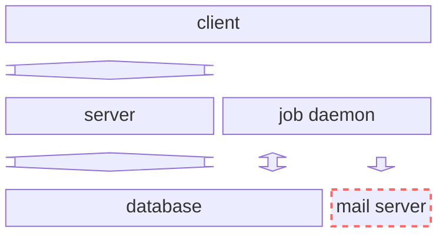
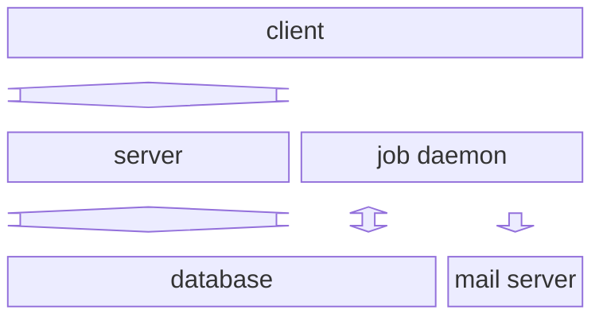

# Freestanding Principle

## Description

A project is freestanding when **all components necessary for the operation and development of the project are provided by the project itself**. A freestanding project doesn’t use resources that are shared with others or interact with external services that must be configured outside the project.

## Benefits

- ensures each developer has a consistent development environment
- prevents potential collisions between environments during development
- allows developers to share the entire state of their changes in a copyable form for others to build on or test

## Approach

Virtualization or emulation should be used to provide all necessary components for the development and operation of a project. It may be necessary to build our own simulated component when the component we wish to simulate does not provide an off-the-shelf container.

Examples of virtualization or emulation includes things like:

- Docker: [PostgreSQL](https://hub.docker.com/_/postgres), [mailpit](https://hub.docker.com/r/axllent/mailpit), etc.
- [Firebase Local Emulator Suite](https://firebase.google.com/docs/emulator-suite)

## Case Studies

### SMTP for starmaker-rebuild

#### Violation

One of the necessary components of the system, an SMTP server, was not contained within the project. This introduced friction and inconsistency to the development process.

The architecture of the project looked like this:

- a database for storing the state of the system
- a client and server to allow users to interact with the system
- a job daemon for processing asynchronous jobs that may occur in the normal operation of the system (generating reports or sending any email required for the system to function)

In order for any mail-related features to be developed, improved, or tested, <strong>an external mail server needed to be set up and development environments needed extra configuration to use it</strong>.

When we used a shared resource, like mail.silverorange.com, we risked impeding the work of others. We could send unwanted mail to other developers or worse, to real customers! 😱

#### Fix

[Contain SMTP server within the project using virtualization and emulation](https://github.com/silverorange/starmaker-rebuild/pull/1107).

[Docker](https://hub.docker.com/r/axllent/mailpit) provides virtualization while [mailpit](https://mailpit.axllent.org) emulates an SMTP server.

Case Studies

1. Using docker to run external services. The Starmaker rebuild project includes a docker container that provides a PostgreSQL database. Docker could also be used to run STMP services for the project. Currently most of our projects use external SMTP servers.
2. Deployment information should also be contained within the project. We don’t want project specific information to live outside the project in places like sync-to-live.
